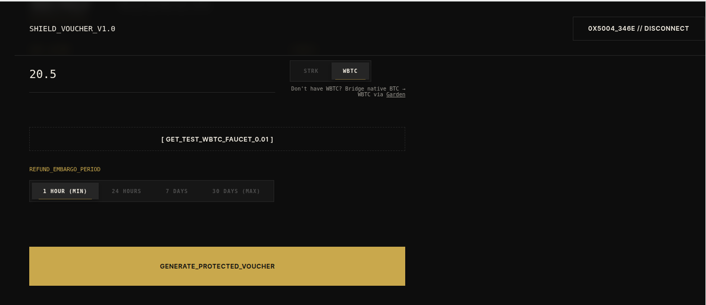
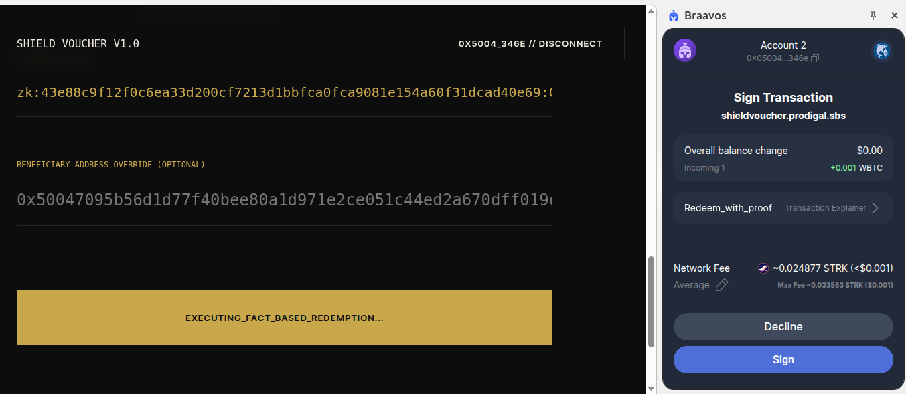
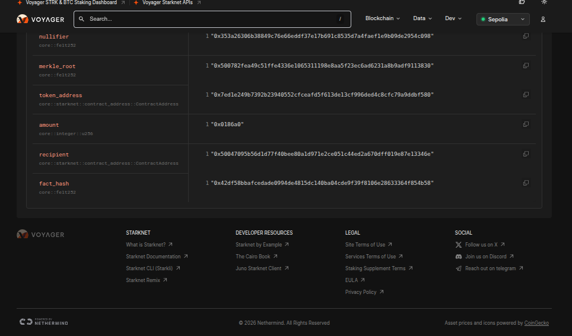

# ShieldVoucher — Private Bitcoin Payment Layer on Starknet

> Deposit WBTC. Get a shield code. Redeem to any wallet. **Zero on-chain link between sender and recipient.**

Privacy is enforced by a Cairo ZK circuit verified on-chain via Herodotus Atlantic STARK proofs and the Integrity FactRegistry. The secret never touches the chain.

Built for the **PL Genesis Hackathon** — Starknet Privacy Track.

---

## The Problem With Bitcoin Payments Today

Bitcoin is often called digital cash — but it's the most transparent cash ever created. Every transaction is permanently public. Send someone Bitcoin, and anyone with an internet connection can see your wallet, their wallet, the exact amount, and the timestamp. Forever.

ShieldVoucher fixes this for Bitcoin payments on Starknet. Deposit WBTC, receive a shield code — like a gift card — and the recipient redeems it to any wallet they choose. No on-chain record connects you to them. Not reduced. Not obscured. **Zero link.**

---

## Bitcoin on Starknet

ShieldVoucher is built around the emerging Bitcoin-on-Starknet stack:

| Step | Tool | What it does |
|------|------|-------------|
| **1. Bridge BTC → WBTC** | [Garden Finance](https://garden.finance) | Trustless Bitcoin bridge to Starknet — bring real BTC into the ecosystem |
| **2. Shield WBTC** | ShieldVoucher | Lock WBTC behind a ZK proof, receive a private shield code |
| **3. Redeem privately** | ShieldVoucher | Recipient proves knowledge of secret via STARK proof, no link to depositor |

> **Testnet note:** The current deployment uses a mock WBTC token on Starknet Sepolia. On mainnet, Garden Finance provides the canonical BTC → WBTC bridge, making ShieldVoucher a native part of the Bitcoin privacy stack on Starknet.

This is the full vision: Bitcoin enters Starknet via Garden, gets shielded via ShieldVoucher, and moves privately — with cryptographic guarantees, not trust assumptions.

---

## Demo

<!-- Add your demo video here. Recommended: record a 3–5 min Loom or YouTube video showing deposit → send → redeem flow -->
[](YOUR_VIDEO_LINK_HERE)

---

## Screenshots

### Deposit — Generate a Shield Code
<!-- Screenshot: CreateVoucher component after generating the zk: code -->


### Redeem — Enter Code and Claim Funds
<!-- Screenshot: RedeemVoucher component showing proof generation progress -->


### Proof Verified On-Chain
<!-- Screenshot: Voyager transaction showing redeem_with_proof with fact_hash -->


---

## How It Works

### Deposit (Shielding)

1. The frontend generates a random **secret** locally — it never leaves the browser
2. A positional **nullifier** is derived: `nullifier = pedersen(secret, leaf_index)`
3. A **commitment** is computed: `commitment = pedersen(secret, nullifier)`
4. The commitment is appended to an on-chain Merkle tree via `lock_funds()`
5. The user receives a **shield code** — a `zk:` string containing everything needed to redeem

### Redeem (Unshielding)

1. The recipient enters the shield code
2. The frontend reconstructs the Merkle tree by scanning on-chain `VoucherCreated` events
3. A **Cairo ZK circuit** proves: *"I know a secret whose commitment exists in the Merkle tree"*
4. Circuit inputs are sent to **Herodotus Atlantic** for off-chain STARK proof generation
5. Atlantic verifies the proof on Starknet L2 via the **Integrity verifier**, registering a `fact_hash`
6. The contract calls `Integrity.is_fact_hash_valid(fact_hash)` — a hard on-chain assert — then verifies the nullifier is unused and Merkle root is valid
7. Funds are released. The nullifier is permanently marked as spent.

**Result:** An observer sees a deposit and a withdrawal with no shared identifier between them. The secret never appears on-chain.

---

## Architecture



---

## Privacy Guarantees

| Data | On-chain? | Identifies depositor? |
|------|-----------|----------------------|
| Secret | Never | N/A — stays in shield code only |
| Merkle path | Never | N/A — stays in circuit input |
| Commitment | Yes (deposit tx) | No — one-way hash, irreversible |
| Nullifier | Yes (redeem tx) | No — derived from secret + index, irreversible |
| Merkle root | Yes (redeem tx) | No — shared public contract state |
| fact_hash | Yes (redeem tx) | No — opaque Integrity receipt |
| Recipient | Yes (redeem tx) | Identifies redeemer only, not depositor |

The ZK proof proves knowledge of the secret without revealing it. Private circuit inputs (secret, Merkle path) are intentionally kept off-chain. No shared identifier exists between deposit and redemption transactions.

### Anonymity Set

Privacy scales with usage. With N participants, an observer has at best a 1-in-N chance of linking a deposit to a withdrawal. Every new user strengthens privacy for all existing users — privacy is a public good in this system.

### Double-Spend Prevention

Each voucher produces a unique nullifier (`pedersen(secret, leaf_index)`). Once redeemed, the nullifier is permanently marked as used on-chain. Any reuse attempt reverts with `'Nullifier used'`.

---

## Starknet Integration

ShieldVoucher uses Starknet's infrastructure at every layer:

| Component | Usage |
|-----------|-------|
| **Cairo 1.0 Smart Contract** | Merkle tree, nullifier tracking, escrow, Integrity verification |
| **Cairo 1.0 ZK Circuit** | Pedersen commitment + Merkle proof in a provable Cairo program |
| **Pedersen Hashing** | Starknet-native hash for commitments, nullifiers, and tree nodes |
| **Herodotus Atlantic** | Off-chain STARK proof generation with on-chain L2 fact registration |
| **Integrity Verifier** | On-chain FactRegistry check via `is_fact_hash_valid()` — hard assert, no mocks |
| **Starknet.js / starknetkit** | Wallet integration with ArgentX and Braavos |
| **Garden Finance** | BTC → WBTC bridge (mainnet path for real Bitcoin entry) |

**Why Starknet?** Starknet's native Pedersen hashing aligns perfectly with our circuit primitives. Atlantic gives us Starknet-native STARK proof generation. ZK verification on L2 costs orders of magnitude less than Ethereum L1. And with Garden Finance bringing real BTC onto Starknet, this is the right infrastructure layer for private Bitcoin payments.

---

## Deployment

**Network:** Starknet Sepolia Testnet

| Component | Address |
|-----------|---------|
| **ShieldVoucher Contract** | [`0x07739...98896b`](https://sepolia.voyager.online/contract/0x07739da35f61c04790dd4ab1bf8a41fb479c412daaa8d23f9d044fbf1098896b) |
| **Mock WBTC Token** | [`0x07ed1...dbf580`](https://sepolia.voyager.online/contract/0x07ed1e249b7392b23940552cfceafd5f613de13cf996ded4c8cfc79a9ddbf580) |
| **Integrity Satellite** | [`0x00421...6676e`](https://sepolia.voyager.online/contract/0x00421cd95f9ddabdd090db74c9429f257cb6bc1ccc339278d1db1de39156676e) |

**Verified redemption on-chain:** [`0x547c214a...e30c5`](https://sepolia.voyager.online/tx/0x547c214a9703091b5ef1e7f1283ef8dc80431e12ade787579d4a59dda9e30c5) — real Integrity verification, no mocks.

---

## Tech Stack

| Layer | Technology |
|-------|-----------|
| Smart Contract | Cairo 1.0 (Scarb 2.16.0, Starknet Foundry v0.57.0) |
| ZK Circuit | Cairo 1.0 library target, executed via Herodotus Atlantic |
| On-chain Verification | Herodotus `integrity = "2.0.0"` (`is_fact_hash_valid`) |
| Frontend | React 18 + TypeScript + Vite |
| Wallet | ArgentX, Braavos (via `starknetkit`) |
| RPC | Alchemy (Starknet Sepolia) |
| Proof API | Herodotus Atlantic (`PROOF_VERIFICATION_ON_L2`) |
| Bitcoin Bridge | Garden Finance (mainnet — BTC → WBTC on Starknet) |

---

## Project Structure

```
shieldvoucher/
  contracts/                    # Cairo smart contract
    src/
      lib.cairo                 # Contract: Merkle tree, Integrity verification, redemption
      mock_wbtc.cairo           # Test WBTC token
      tests.cairo               # Unit tests
    Scarb.toml
  circuit/                      # ZK circuit for Atlantic
    src/
      lib.cairo                 # Pedersen commitment + Merkle proof verification
    Scarb.toml
  frontend/                     # React frontend
    src/
      api/
        atlantic.ts             # Atlantic API: submit, poll, extract integrityFactHash
        circuit_data.ts         # Compiled circuit Sierra (base64)
      components/
        CreateVoucher.tsx       # Deposit: generate secret, derive commitment, lock funds
        RedeemVoucher.tsx       # Redeem: reconstruct tree, prove, verify, release
        SendVoucher.tsx         # Send: approve + lock in one flow
      hooks/
        useShieldVoucher.ts     # Contract interactions: lock, redeem, events, state
      utils/
        merkle.ts               # Incremental Pedersen Merkle tree (20 levels)
  tests/                        # Integration tests
  assets/                       # Architecture diagram and screenshots
```

---

## Setup

### Prerequisites

- [Scarb](https://docs.swmansion.com/scarb/) — Cairo package manager
- [Starknet Foundry](https://foundry-rs.github.io/starknet-foundry/) v0.57.0
- Node.js 18+
- Starknet wallet ([ArgentX](https://www.argent.xyz/argent-x/) or [Braavos](https://braavos.app/)) on Sepolia testnet
- [Herodotus Atlantic API key](https://dashboard.herodotus.dev/)

### Installation

```bash
# 1. Clone
git clone https://github.com/jerrygeorge360/shieldvoucher.git
cd shieldvoucher

# 2. Frontend dependencies
cd frontend && npm install

# 3. Build smart contract
cd ../contracts && scarb build

# 4. Build ZK circuit
cd ../circuit && scarb build

# 5. Configure environment
cat > frontend/.env << EOF
VITE_CONTRACT_ADDRESS=0x07739da35f61c04790dd4ab1bf8a41fb479c412daaa8d23f9d044fbf1098896b
VITE_RPC_URL=<your-starknet-sepolia-rpc-url>
VITE_ATLANTIC_API_KEY=<your-herodotus-atlantic-api-key>
EOF

# 6. Run
cd frontend && npm run dev
```

---

## Usage

### 1. Shield (Deposit)
- Connect your Starknet wallet (ArgentX or Braavos)
- Select WBTC and enter an amount
- On mainnet: bridge real BTC first via [Garden Finance](https://garden.finance)
- Click **Generate Protected Voucher**
- Save the `zk:` shield code — treat it like cash

### 2. Transfer
- Send the shield code to the recipient by any channel: message, email, QR code
- No account relationship required. The code is the voucher.

### 3. Unshield (Redeem)
- Enter the shield code in the **Redeem** tab
- The app reconstructs the Merkle tree from on-chain events and runs pre-flight checks
- Submits the ZK circuit to Atlantic for STARK proof generation
- Atlantic verifies the proof on Starknet L2 and registers the fact hash
- The contract verifies via Integrity and releases funds to the recipient
- **Total time:** ~10–15 minutes (proof generation + L2 verification)

---

## Key Features

- **Real on-chain ZK verification** — `Integrity.is_fact_hash_valid()` with hard assert, no mocks anywhere
- **Depositor-redeemer unlinkability** — no shared on-chain identifier between deposit and withdrawal
- **Private circuit inputs** — secret and Merkle path never appear in any transaction or calldata
- **Real STARK proofs** — cryptographic proofs via Herodotus Atlantic, not simulations
- **Double-spend protection** — nullifier-based, permanent, on-chain
- **Anonymity set scaling** — privacy strengthens with every new participant
- **Incremental Merkle tree** — 20 levels, over 1 million voucher capacity
- **Pre-flight validation** — local checks before Atlantic submission, saving time and API calls
- **Bitcoin-native path** — Garden Finance integration for trustless BTC entry on mainnet

---

## Roadmap

- [ ] Mainnet deployment with Garden Finance BTC → WBTC bridge integration
- [ ] Relayer support — recipient never needs to touch the chain themselves
- [ ] Fixed denomination pools — stronger anonymity set, amount correlation resistance
- [ ] Mobile-friendly QR redemption flow
- [ ] Multi-token support beyond WBTC

---

## Security Considerations

- **Fact hash verification:** The contract verifies the `integrityFactHash` is registered in Integrity's FactRegistry — proving a valid STARK proof was verified on Starknet. Private inputs are kept off-chain intentionally to preserve unlinkability.
- **Nullifier uniqueness:** Deterministic per voucher. Double-redemption is impossible on-chain.
- **Root validation:** Only Merkle roots previously registered on-chain are accepted — prevents fake tree attacks.
- **Testnet:** Current deployment is Sepolia. Production deployment requires a full security audit.

---

## Team

| Name | Role |
|------|------|
| Jerry George | Builder — contracts, circuit, frontend |

---

## License

MIT. Built for the **PL Genesis Hackathon** — Starknet Privacy Track.